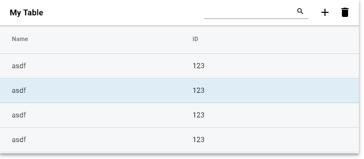

# ngxux-mat-table



## Example

```
<div class="table mat-elevation-z5">

    <ngxux-mat-table title="My Table"
                     [headerShow]="true"
                     [columns]="columns"
                     [searchShow]="true"
                     [addShow]="true"
                     [removeShow]="true"
                     [headerSticky]="true"
                     (rowClick)="rowClicked($event)"
                     [data]="data"></ngxux-mat-table>


</div>
```
